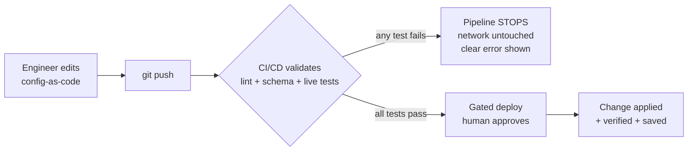
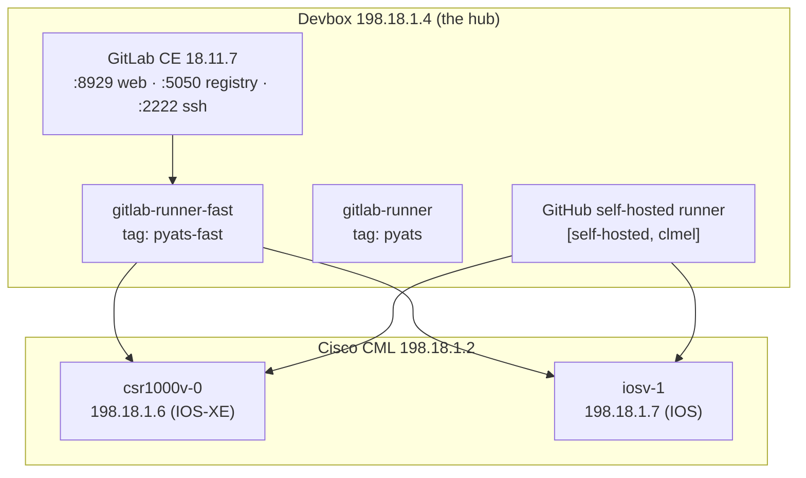
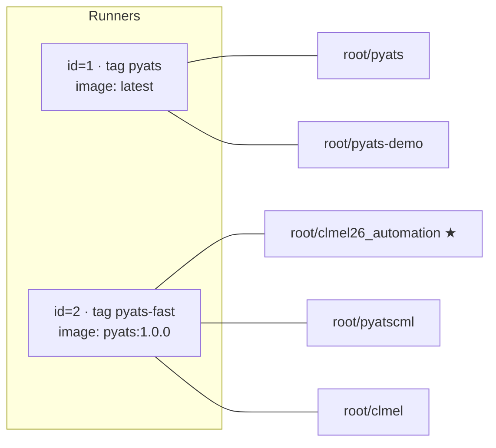
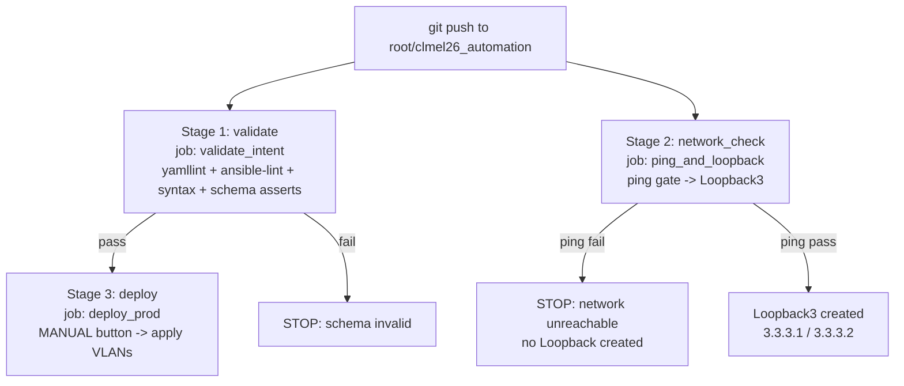

# CLMEL26 NetDevOps Automation — End‑to‑End Lab Guide & Project Documentation

> **Project:** `root/clmel26_automation` — a NetDevOps CI/CD lab (rebuilt from **LTRENS‑2687** for **CLMEL26 / 2026**).
> **Purpose:** Prove that network configuration can be **described as code, tested automatically, and only applied to real routers when every test passes** — so a bad change is stopped *before* it ever reaches the network.
> **Audience:** Lab attendees and engineers who want to run, understand, and re‑use this pipeline on their own server.

This single document explains **everything**: what the lab does, *why* CI/CD matters to the business, every file in the repository, the runners and where they are bound, all the tests, and — most importantly — the **failure** and **success** scenarios with exact steps to reproduce and verify each one.

---

## Table of contents

1. [What this lab is](#1-what-this-lab-is)
2. [Why CI/CD? Importance & benefits to the company](#2-why-cicd-importance--benefits-to-the-company)
3. [Lab environment & topology](#3-lab-environment--topology)
4. [CI/CD platforms & runners — what is configured and bound where](#4-cicd-platforms--runners--what-is-configured-and-bound-where)
5. [Full project file structure](#5-full-project-file-structure)
6. [Every file explained](#6-every-file-explained)
7. [Tests & jobs available in this project](#7-tests--jobs-available-in-this-project)
8. [Pipeline stages & flow](#8-pipeline-stages--flow)
9. [Failure scenarios — and how to check them](#9-failure-scenarios--and-how-to-check-them)
10. [Working scenarios — and how to check them](#10-working-scenarios--and-how-to-check-them)
11. [Step‑by‑step lab tasks](#11-step-by-step-lab-tasks)
12. [Verification & command cheat‑sheet](#12-verification--command-cheat-sheet)
13. [Port it to another server](#13-port-it-to-another-server)
14. [Appendix — credentials, URLs, glossary](#14-appendix--credentials-urls-glossary)

---

## 1. What this lab is

This repository is a **working example of "network as code."** Instead of an engineer logging into routers by hand and typing commands, the *intended* state of the network is written into small text files, committed to Git, and pushed. A **CI/CD pipeline** then automatically:

1. **Validates** the change (lint + schema checks + live network tests), and
2. Only if validation passes, **deploys** the change to the routers.

The lab deliberately demonstrates **two independent automation stacks** against the **same** pair of virtual routers, so you can compare approaches:

| Stack | Tooling | What it manages | Where it runs |
| --- | --- | --- | --- |
| **Ansible VLAN task** | Ansible + `cisco.ios` collection | VLANs and access‑port assignments | GitLab CI **and** a mirrored GitHub Actions pipeline |
| **pyATS/Genie tasks** | Cisco pyATS + Genie + Unicon | Reachability tests, static‑route checks, Loopback interfaces | GitLab CI |

And it demonstrates **two CI/CD platforms**:

- **GitLab CI/CD** — the lab's *real* CI system, running on the devbox at `198.18.1.4`. This is where the `.gitlab-ci.yml` pipeline executes.
- **GitHub Actions** — a mirror of the Ansible pipeline that runs on a **self‑hosted** GitHub runner registered on the same devbox.

> **The one idea to take away:** *Validate before you touch production. If any test fails, change nothing.* Every job in this project is built around that guardrail.

---

## 2. Why CI/CD? Importance & benefits to the company

### The problem CI/CD solves

Traditional network changes are **manual, unaudited, and risky**:

- A single mistyped VLAN id or interface name can black‑hole traffic.
- Changes are applied straight to production with no automated test.
- There is no consistent record of *who* changed *what*, *why*, or whether it was reviewed.
- Knowledge lives in individuals' heads, not in the system.

### What this pipeline gives you



### Benefits to the company

| Benefit | How this lab delivers it |
| --- | --- |
| **Risk reduction** | A wrong VLAN id (e.g. `5000`) or an unreachable network is caught *before* any device is touched — the deploy never runs. |
| **Test before touch** | pyATS pings the network and Ansible asserts the schema *first*; production is only changed after a green result. |
| **Repeatability & consistency** | The same playbook/script produces the same result every time — no "it works on my laptop" drift. |
| **Peer review & audit** | Every change is a Git commit: reviewable, revertable, and traceable to an author and a pipeline run. |
| **Safe, gated production** | The production stage is **manual / approval‑gated** — a human clicks *Deploy* only after tests are green. |
| **Faster, cheaper changes** | Automation removes slow, error‑prone manual steps and the rework caused by outages. |
| **Knowledge capture** | The "how" lives in the repo (playbooks, tests, docs), not in one engineer's memory. |
| **Idempotency** | Re‑running a job does not create duplicates (e.g. an existing Loopback is skipped), so pipelines are safe to retry. |

---

## 3. Lab environment & topology

Everything runs inside the CML‑hosted lab. The **devbox (`198.18.1.4`) is the hub**: it hosts GitLab, the CI runners, and is the only host that can reach the CML‑simulated routers.

| Component | Address | Credentials | Role |
| --- | --- | --- | --- |
| Cisco CML | `198.18.1.2` | `admin / C1sco12345` | Runs the virtual routers |
| GitLab Web UI | `http://198.18.1.4:8929/` | `root / C1sco12345` | Source control + CI/CD |
| GitLab container registry | `198.18.1.4:5050` | — | Hosts the pyATS runner image |
| GitLab SSH (git) | `198.18.1.4:2222` | — | Git over SSH |
| Devbox (Ubuntu) | `198.18.1.4` | `cisco / C1sco12345` | Hosts GitLab + runners; reaches routers |
| `iosv-1` (Cisco IOS) | `198.18.1.7` | `admin / C1sco12345`, enable `C1sco12345` | Router under test |
| `csr1000v-0` (Cisco IOS‑XE) | `198.18.1.6` | `admin / C1sco12345`, enable `C1sco12345` | Router under test |



---

## 4. CI/CD platforms & runners — what is configured and bound where

### GitLab runners (the real lab CI)

Two runner **containers** run on the devbox; each registers one runner with GitLab. Both use the **docker executor**. Runners are **project‑scoped** (not shared), so each project is explicitly bound to a runner.

| Runner container | GitLab runner | Tag | Executor | Default image | Bound to projects |
| --- | --- | --- | --- | --- | --- |
| `gitlab-runner` (ubuntu‑v18.11.4) | id=1 · "pyATS Docker runner" | `pyats` | docker | `latest` | `root/pyats`, `root/pyats-demo` |
| `gitlab-runner-fast` (alpine‑v18.11.4) | id=2 · "pyATS‑fast‑docker‑runner" | `pyats-fast` | docker | `198.18.1.4:5050/root/pyatscml/pyats:1.0.0` | **`root/clmel26_automation`**, `root/pyatscml`, `root/clmel` |

> **This project (`root/clmel26_automation`, project id 5, private) is bound to runner id=2, tag `pyats-fast`.** That is why `.gitlab-ci.yml` sets `tags: ["pyats-fast"]` and the pyATS image as the default — the runner already has pyATS/Genie/Unicon, and Ansible is pip‑installed at job start.



**All GitLab projects on this server:**

| id | Project | Visibility | Runner |
| --- | --- | --- | --- |
| 1 | `root/pyats` | public | `pyats` |
| 2 | `root/pyats-demo` | public | `pyats` |
| 3 | `root/pyatscml` | private | `pyats-fast` |
| 4 | `root/clmel` | public | `pyats-fast` |
| 5 | **`root/clmel26_automation`** | private | **`pyats-fast`** |

### GitHub Actions runner (the mirror)

The Ansible pipeline also runs on GitHub via `.github/workflows/ansible-vlan.yml`, targeting a **self‑hosted** runner labelled `[self-hosted, clmel]` registered on the *same* devbox — because only the devbox can reach the CML routers. GitHub‑hosted (cloud) runners cannot reach `198.18.1.6/.7`, so a self‑hosted runner is required for anything that touches the devices.

---

## 5. Full project file structure

```
clmel26_automation/
├── .github/
│   └── workflows/
│       └── ansible-vlan.yml       # GitHub Actions: validate (test/dev) -> deploy (prod)
├── .gitlab-ci.yml                 # GitLab CI: validate -> network_check -> deploy
├── .gitignore                     # ignore pyATS artifacts, caches, editor files
├── README.md                      # repo overview + quick start
├── requirements.txt               # Python deps for pyATS jobs (pyats[full], genie, PyYAML)
│
├── testbed/
│   └── testbed.yaml               # pyATS device inventory (IPs, OS, SSH creds)
│
├── jobs/                          # pyATS / Genie automation
│   ├── smoke_job.py               # pyATS easypy entry point -> runs the test script
│   ├── configure_loopback.py      # applies Loopback300 (2.2.2.2) when tests pass
│   ├── ping_and_loopback.py       # ping gate -> duplicate-checked Loopback3 (3.3.3.x)
│   └── tests/
│       └── test_ping_routes.py    # pyATS testcases: ping gateway + static-route parity
│
├── configs/                       # declarative data consumed by the jobs
│   ├── loopbacks.yaml             # Loopback300 = 2.2.2.2/32 on both routers
│   └── loopback3.yaml             # ping_target + Loopback3 = 3.3.3.1 / 3.3.3.2
│
├── ansible/                       # Ansible VLAN task
│   ├── ansible.cfg                # inventory path, collections path, timeouts
│   ├── requirements.yml           # collections: cisco.ios, ansible.netcommon
│   ├── .yamllint                  # YAML lint rules
│   ├── .ansible-lint              # ansible-lint profile (min)
│   ├── inventory/
│   │   └── hosts.yml              # test + prod device groups
│   ├── group_vars/
│   │   └── all.yml                # connection creds (network_cli, admin/C1sco12345)
│   ├── vars/
│   │   └── vlans.yml              # VLAN intent — ATTENDEES EDIT THIS
│   └── playbooks/
│       ├── validate_vlans.yml     # test/dev gate: schema asserts (no device needed)
│       └── configure_vlans.yml    # applies VLANs + access ports to routers
│
└── docs/                          # HTML lab guide (GitHub Pages source)
    ├── index.html ... (multi-page site)
    ├── project-guide.html         # << this document, as a standalone HTML report
    └── project-guide.md           # << this document, in Markdown
```

---

## 6. Every file explained

### Root

| File | What it is / does |
| --- | --- |
| `.gitlab-ci.yml` | The GitLab pipeline. Declares 3 stages (`validate`, `network_check`, `deploy`), sets the default runner tag `pyats-fast` and the pyATS image, and defines the jobs `validate_intent`, `ping_and_loopback`, and `deploy_prod`. |
| `.github/workflows/ansible-vlan.yml` | The GitHub Actions pipeline (mirror of the Ansible flow). `validate` job lints + asserts the VLAN schema; `deploy` job applies to routers on `main`, gated by `needs: validate` and an `environment: production`. Runs on `[self-hosted, clmel]`. |
| `.gitignore` | Keeps pyATS run artifacts (`logs/`, `runinfo/`, `archive/`, `*.log`), Python caches, and editor folders out of Git. |
| `README.md` | Human overview + quick‑start commands and the lab environment table. |
| `requirements.txt` | Python packages the pyATS jobs need: `pyats[full]`, `genie`, `PyYAML`. |

### `testbed/`

| File | What it is / does |
| --- | --- |
| `testbed.yaml` | pyATS device inventory. Defines `iosv-1` (`os: ios`, `198.18.1.7`) and `csr1000v-0` (`os: iosxe`, `198.18.1.6`), both connecting over SSH with `unicon.Unicon`. Includes legacy SSH options (`diffie-hellman-group14-sha1`, `ssh-rsa`) required by older IOS images, plus login/enable credentials. |

### `jobs/` (pyATS / Genie)

| File | What it is / does |
| --- | --- |
| `smoke_job.py` | A pyATS **easypy** job. Its `main(runtime)` runs the test script `tests/test_ping_routes.py` against the testbed. Invoke with `pyats run job jobs/smoke_job.py --testbed-file testbed/testbed.yaml`. |
| `tests/test_ping_routes.py` | The pyATS **AEtest** script. `CommonSetup` connects to all devices; `PingGateway` pings `192.168.1.1` from every router (fails if success rate < 100%); `StaticRoutesEqual` compares the set of static (`S`) routes across routers and fails on mismatch; `CommonCleanup` disconnects. |
| `configure_loopback.py` | Stand‑alone script that reads `configs/loopbacks.yaml` and creates `Loopback300 = 2.2.2.2/32` on each router **if it does not already exist** (idempotent), saves config, and verifies. Exits `1` on any verification failure. |
| `ping_and_loopback.py` | The headline job (see §7). **Step 1** pings a target from *both* routers; if any router fails, it prints a clear error and exits `1` — **nothing is configured**. **Step 2** (only if all pings passed) creates `Loopback3` from `configs/loopback3.yaml`, first checking for a **duplicate** (existing `Loopback3`, or the IP already used by another interface) and skipping if found. Supports `--target` (override) and `--dry-run` (report only, no changes). |

### `configs/`

| File | What it is / does |
| --- | --- |
| `loopbacks.yaml` | Declarative data for `configure_loopback.py`: `Loopback300 = 2.2.2.2/32` on `iosv-1` and `csr1000v-0`. |
| `loopback3.yaml` | Declarative data for `ping_and_loopback.py`: `ping_target: 192.168.1.1`, plus `Loopback3 = 3.3.3.1/32` on `csr1000v-0` and `Loopback3 = 3.3.3.2/32` on `iosv-1`. Change `ping_target` here to steer the pass/fail path. |

### `ansible/`

| File | What it is / does |
| --- | --- |
| `ansible.cfg` | Points Ansible at `inventory/hosts.yml`, sets `collections_path`, disables host‑key checking (lab), and sets 60‑second connection timeouts. |
| `requirements.yml` | Galaxy collections required: `cisco.ios >= 5.0.0`, `ansible.netcommon >= 5.0.0`. |
| `.yamllint` | YAML style rules (extends default, relaxes line length to 160). |
| `.ansible-lint` | Uses the `min` profile — fail on real errors, not style opinions. |
| `inventory/hosts.yml` | Two groups, `test` and `prod`, each containing `iosv-1` (`198.18.1.7`) and `csr1000v-0` (`198.18.1.6`). The playbook chooses the group via `-e target=…`. |
| `group_vars/all.yml` | Connection settings for every router: `network_cli`, `cisco.ios.ios`, user `admin`, password + enable `C1sco12345`. *(Lab creds only — use Vault/CI secrets in production.)* |
| `vars/vlans.yml` | **The file attendees edit.** The declared VLAN intent: `USERS` id 10 → `Gi0/1`, `VOICE` id 20 → `Gi0/2`, `MGMT` id 30 → `Gi0/3`. |
| `playbooks/validate_vlans.yml` | The **test/dev gate**. Runs on `localhost` (no device needed) and asserts: ≥1 VLAN; id is a whole number 1–4094 and not 1002–1005; name 1–32 chars `[A-Za-z0-9_-]`; interface matches `GigabitEthernet<slot>/<port>`; ids are unique. Any failure stops the pipeline with a detailed message. |
| `playbooks/configure_vlans.yml` | The **apply** step. Builds the VLAN list, creates/updates VLANs with `cisco.ios.ios_vlans`, assigns access VLANs to interfaces with `cisco.ios.ios_l2_interfaces`, then saves config. Targets `{{ target | default('test') }}`. |

### `docs/`

The `docs/` folder is the GitHub Pages source: a self‑contained multi‑page HTML lab guide (`index.html`, `overview.html`, `pipeline.html`, `ansible-vlans.html`, …) plus `assets/style.css` and `assets/app.js`. **This document** is added as `project-guide.html` (standalone report) and `project-guide.md` (portable Markdown).

---

## 7. Tests & jobs available in this project

| Job / test | Tooling | What it checks / does | Where it runs | On failure |
| --- | --- | --- | --- | --- |
| `validate_intent` (GitLab) / `validate` (GitHub) | Ansible + yamllint + ansible‑lint | Lints YAML & playbooks, syntax‑checks, and asserts the VLAN schema in `vars/vlans.yml`. **No device contacted.** | GitLab `validate` stage / GitHub `validate` job | Pipeline fails with a detailed message; deploy never runs |
| `ping_and_loopback` | pyATS/Genie | **Step 1:** both routers ping `192.168.1.1`. **Step 2:** if all pass, create duplicate‑checked `Loopback3`. | GitLab `network_check` stage | Prints per‑router ping result + "PIPELINE FAILED"; exits 1; **no config applied** |
| `deploy_prod` (GitLab) / `deploy` (GitHub) | Ansible `cisco.ios` | Dry‑run (`--check --diff`) then apply VLANs to the routers. **Manual/approval gated.** | GitLab `deploy` stage / GitHub `deploy` job | Job fails; VLANs not applied |
| `test_ping_routes.py` | pyATS AEtest | `PingGateway` (ping `192.168.1.1`, needs 100%) + `StaticRoutesEqual` (route parity across routers). | Local / pyATS runner via `smoke_job.py` | Testcase marked failed; job returns non‑zero |
| `configure_loopback.py` | pyATS/Genie | Idempotently create `Loopback300 = 2.2.2.2/32` on both routers. | Local / pyATS runner | Exits 1 on verification failure |

---

## 8. Pipeline stages & flow

### GitLab CI/CD (`.gitlab-ci.yml`)



- **`validate` → `validate_intent`**: installs Ansible + linters, then runs `yamllint`, `ansible-lint`, `--syntax-check`, and `validate_vlans.yml`. Pure static checks — **no device is touched**.
- **`network_check` → `ping_and_loopback`**: `needs: []` (independent), runs the pyATS ping‑gate script.
- **`deploy` → `deploy_prod`**: `needs: ["validate_intent"]` and `when: manual` — a human clicks **Deploy** in the GitLab UI; it dry‑runs then applies the VLANs to the routers.

### GitHub Actions (`.github/workflows/ansible-vlan.yml`)

`validate` (test/dev) → `deploy` (prod). `deploy` requires `needs: validate`, only runs on `main` (not on PRs), and uses `environment: production` (add required reviewers for an approval gate). Both jobs run on `[self-hosted, clmel]` on the devbox.

---

## 9. Failure scenarios — and how to check them

Each scenario below shows **how to trigger it**, **what you should see**, and **where to look**. These are the guardrails in action — in every case, **production is left untouched**.

### F1 — Invalid VLAN id (out of range)

- **Trigger:** in `ansible/vars/vlans.yml`, set a VLAN `id: 5000` (valid range is 1–4094), commit and push.
- **Expected:** the `validate` job fails on the "VLAN id must be a whole number 1‑4094" assertion with:
  > `INVALID VLAN id '5000' (name 'VOICE'). VLAN ids must be a whole number 1-4094 and must not use the reserved range 1002-1005. Fix vars/vlans.yml and push again.`
- **Where to check:** GitLab → **CI/CD → Pipelines → the failing `validate_intent` job log**; the `deploy` stage never starts.

### F2 — Invalid VLAN name or interface name

- **Trigger:** set a VLAN `name` containing a space (e.g. `VOICE PHONES`) *or* an interface like `GigabitEth0/1` (typo).
- **Expected:** the name assertion (`1-32 chars, letters/numbers/underscore/hyphen only`) or the interface assertion (`GigabitEthernet<slot>/<port>`) fails with a detailed message naming the offending value.
- **Where to check:** same `validate` job log.

### F3 — Duplicate VLAN id

- **Trigger:** define the same `id` twice in `vars/vlans.yml`.
- **Expected:** the "VLAN ids must be unique" assertion fails: `Duplicate VLAN ids detected …`.
- **Where to check:** `validate` job log.

### F4 — Network unreachable (ping gate)

- **Trigger:** in `configs/loopback3.yaml`, set `ping_target: 198.168.1.1` (an address the routers cannot reach), push.
- **Expected:** `ping_and_loopback` prints per‑router failures and stops **before** any config:
  ```
  ======================================================================
  STEP 1  Ping pre-check  ->  every router must reach 198.168.1.1
  ======================================================================
    [FAIL] iosv-1 -> 198.168.1.1: success rate 0%   (Success rate is 0 percent (0/5))
    [FAIL] csr1000v-0 -> 198.168.1.1: success rate 0%   (Success rate is 0 percent (0/5))
  ======================================================================
  PIPELINE FAILED  -  ping pre-check did not pass
  ======================================================================
  One or more routers cannot reach 198.168.1.1, so Loopback3 was
  NOT created on ANY device. Fix reachability and re-run the pipeline.
  ```
  The job exits `1` → the `network_check` stage is red → **no Loopback3 is created on either router.**
- **Where to check:** the `ping_and_loopback` job log. Confirm on the routers that `Loopback3` is absent: `show ip interface brief | include Loopback3`.

> This scenario was verified live against the lab routers: target `198.168.1.1` returns **0%** from both routers (fails), while `192.168.1.1` returns **100%** (passes).

---

## 10. Working scenarios — and how to check them

### W1 — Valid VLANs deploy

- **State:** `vars/vlans.yml` holds valid VLANs (the default: `USERS/10`, `VOICE/20`, `MGMT/30`).
- **Flow:** `validate` passes → click **Deploy** on `deploy_prod` → VLANs applied.
- **Verify on a router:**
  ```
  show vlan brief
  show running-config interface GigabitEthernet0/1   ! expect: switchport access vlan 10
  ```

### W2 — Ping passes → Loopback3 created

- **State:** `configs/loopback3.yaml` has `ping_target: 192.168.1.1` (reachable).
- **Expected job output:**
  ```
  STEP 1  Ping pre-check  ->  every router must reach 192.168.1.1
    [PASS] iosv-1 -> 192.168.1.1: success rate 100%   (... 5/5 ...)
    [PASS] csr1000v-0 -> 192.168.1.1: success rate 100%   (... 5/5 ...)
    OK: every router reached 192.168.1.1. Proceeding to Loopback3.
  STEP 2  Create Loopback3 on each router (skip if duplicate)
    [CFG ] csr1000v-0: creating Loopback3 3.3.3.1 255.255.255.255
    [OK  ] csr1000v-0: verified Loopback3 has 3.3.3.1
    [CFG ] iosv-1: creating Loopback3 3.3.3.2 255.255.255.255
    [OK  ] iosv-1: verified Loopback3 has 3.3.3.2
  SUCCESS  -  ping passed and Loopback3 is in place on all routers
  ```
- **Verify on the routers:**
  ```
  csr1000v-0#  show ip interface brief | include Loopback3     ! Loopback3  3.3.3.1  up  up
  iosv-1#      show ip interface brief | include Loopback3     ! Loopback3  3.3.3.2  up  up
  ```

### W3 — Duplicate Loopback is skipped (idempotent)

- **State:** re‑run W2 when `Loopback3` already exists (or its IP is used elsewhere).
- **Expected:** `[SKIP] … Loopback3 already exists (duplicate) - not re-creating` (or `duplicate IP`). The job still succeeds. Safe to retry pipelines.

### W4 — pyATS ping/route test passes

- Run `pyats run job jobs/smoke_job.py --testbed-file testbed/testbed.yaml`. `PingGateway` passes when both routers reach `192.168.1.1` at 100%; `StaticRoutesEqual` passes when both routers share the same static routes.

---

## 11. Step‑by‑step lab tasks

> **Task 0 — Prerequisites.** You have access to the devbox and the GitLab UI at `http://198.18.1.4:8929/`. The `root/clmel26_automation` project exists and is bound to the `pyats-fast` runner.

**Task 1 — Get the code.**
```bash
git clone http://198.18.1.4:8929/root/clmel26_automation.git
cd clmel26_automation
```

**Task 2 — (Optional) Dry‑run the ping/loopback job locally** using the pyATS runner image (read‑only, no changes):
```bash
docker run --rm -v "$PWD":/build -w /tmp \
  --entrypoint sh 198.18.1.4:5050/root/pyatscml/pyats:1.0.0 \
  -c "python /build/jobs/ping_and_loopback.py \
        --testbed /build/testbed/testbed.yaml \
        --config  /build/configs/loopback3.yaml --dry-run"
```

**Task 3 — Break it on purpose (see the guardrail).** Edit `ansible/vars/vlans.yml`, set a VLAN `id: 5000`, then:
```bash
git commit -am "demo: invalid VLAN id 5000"
git push
```
Watch **CI/CD → Pipelines** — `validate_intent` fails with the clear error; nothing deploys.

**Task 4 — Fix and pass.** Restore `id: 20`, commit, push. `validate_intent` goes green. Open the **`deploy_prod`** job and click **Deploy** to apply the VLANs.

**Task 5 — Run the ping → Loopback3 job.** Ensure `configs/loopback3.yaml` has `ping_target: 192.168.1.1`, push, and watch `ping_and_loopback` create `Loopback3` on both routers. To demo the failure path, set it to `198.168.1.1` and push again.

**Task 6 — Verify on the routers** (see §12).

---

## 12. Verification & command cheat‑sheet

**Push to the lab GitLab (you enter your own GitLab credentials):**
```bash
git add -A
git commit -m "your change"
git push        # origin is the GitLab project
```

**Watch the pipeline:** `http://198.18.1.4:8929/root/clmel26_automation/-/pipelines`

**On the routers (SSH `admin / C1sco12345`, enable `C1sco12345`):**
```
show ip interface brief | include Loopback     ! Loopback3 = 3.3.3.1 / 3.3.3.2
show vlan brief                                ! VLANs 10/20/30
show running-config interface GigabitEthernet0/2
ping 192.168.1.1                               ! the ping-gate target
```

**Run pyATS locally:**
```bash
pip install -r requirements.txt
pyats run job jobs/smoke_job.py --testbed-file testbed/testbed.yaml
python jobs/ping_and_loopback.py --testbed testbed/testbed.yaml --config configs/loopback3.yaml --dry-run
```

**Run Ansible locally:**
```bash
cd ansible
ansible-galaxy collection install -r requirements.yml
ansible-playbook playbooks/validate_vlans.yml                    # test/dev gate
ansible-playbook -i inventory/hosts.yml playbooks/configure_vlans.yml -e target=prod
```

---

## 13. Port it to another server

This project is self‑contained. To run it elsewhere:

1. **Copy the repo** (or just the folders you need: `jobs/`, `testbed/`, `configs/`, `ansible/`, and one of `.gitlab-ci.yml` / `.github/workflows/`).
2. **Update device details** in `testbed/testbed.yaml` (pyATS) and `ansible/inventory/hosts.yml` + `ansible/group_vars/all.yml` (Ansible): set the real router IPs and credentials. **Move secrets to Ansible Vault or CI/CD variables** — do not commit plain‑text passwords in production.
3. **Point the ping target** in `configs/loopback3.yaml` at an address your routers should reach.
4. **Provide a runner:**
   - *GitLab:* register a runner, give it a tag, and set that tag in `.gitlab-ci.yml` (`default.tags`). If you don't use the registry pyATS image, add a `before_script` that `pip install`s `pyats[full] genie PyYAML`.
   - *GitHub:* register a self‑hosted runner with a label and set it in `runs-on:`.
5. **Re‑point the image** in `.gitlab-ci.yml` (`default.image`) to wherever your pyATS image lives, or drop the image line and install deps in `before_script`.
6. **Render this doc anywhere:** `project-guide.md` renders on GitLab/GitHub/Obsidian (Mermaid diagrams included); `project-guide.html` opens standalone in any browser with no dependencies.

---

## 14. Appendix — credentials, URLs, glossary

### Credentials (lab only)

| Where | User | Password |
| --- | --- | --- |
| CML | `admin` | `C1sco12345` |
| GitLab UI | `root` | `C1sco12345` |
| Devbox | `cisco` | `C1sco12345` |
| Routers (login + enable) | `admin` | `C1sco12345` |

### Key URLs

| Thing | URL |
| --- | --- |
| GitLab project | `http://198.18.1.4:8929/root/clmel26_automation` |
| GitLab pipelines | `http://198.18.1.4:8929/root/clmel26_automation/-/pipelines` |
| Container registry | `198.18.1.4:5050` |
| Published HTML lab guide | `https://ranilf2005.github.io/clmel26_automation/` |

### Glossary

- **CI/CD** — Continuous Integration / Continuous Delivery: automatically test every change and safely deliver it.
- **Runner** — the agent that executes pipeline jobs (here: docker‑executor containers on the devbox).
- **pyATS / Genie / Unicon** — Cisco's Python test/automation framework, its parsing library, and its device‑connection library.
- **Testbed** — the pyATS device inventory (`testbed/testbed.yaml`).
- **Idempotent** — running a job again produces the same result without creating duplicates.
- **Gate** — a stage that blocks progress until a condition is met (tests pass, a human approves).

---

*Generated for CLMEL26 (2026), rebuilt from the LTRENS‑2687 NetDevOps lab. Lab credentials and addresses are for the isolated lab environment only.*
